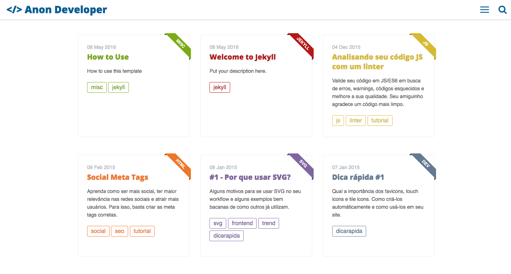

## Cards Jekyll Template - [Demo](https://willianjusten.com.br/cards-jekyll-template)



This is a simple and minimalist template for Jekyll designed for developers that want to write blog posts but don't want to care about frontend stuff.

The Theme features:

- Gulp
- Stylus (Jeet, Rupture, Kouto Swiss)
- Live Search
- Offcanvas Menu
- SVG icons
- Very very small and fast!
- Shell Script to create posts
- Tags page
- Series page
- About Me page
- Feed RSS
- Sitemap.xml
- Color Customization
- Info Customization

If you want to see this template in real action, take a look at my [original site](http://willianjusten.com.br/).

## Basic Setup

1. [Install Jekyll](http://jekyllrb.com) (use the command ```sudo gem install jekyll```)
2. Fork the [Cards Jekyll Template](https://github.com/willianjusten/cards-jekyll-template/fork)
3. Clone the repo you just forked.
4. Edit `_config.yml` to personalize your site.
5. Check out the sample posts in `_posts` to see examples for assigning categories and tags, and other YAML data.
6. Read the documentation below for further customization pointers and documentation.
7. **Remember to compile your assets files with Gulp.**

## Site and User Settings

You have to fill some informations on `_config.yml` to customize your site.

```
# Site settings
title: Willian Justen - Desenvolvedor Front End
description: A blog about lorem ipsum dolor sit amet
baseurl: "" # the subpath of your site, e.g. /blog/ or empty.
url: "http://localhost:3000" # the base hostname & protocol for your site 

# User settings
username: Lorem Ipsum
user_description: Anon Developer at Lorem Ipsum Dolor
email: anon@anon.com
twitter_username: lorem_ipsum
github_username:  lorem_ipsum
gplus_username:  lorem_ipsum
disqus_username: lorem_ipsum
```

## Header Name

To use the power of CSS Content and media query, the header name is defined on [src/styl/_header.styl](src/styl/_header.styl). Change to your prefered name.

## Color customization

All color variables are in [src/styl/_variables.styl](src/styl/_variables.styl). To change the main color, just set the new value at `main` assignment. Another colors are for texts and the code background color.

## Theme Colors

Every post has a main color that is defined on [src/styl/_theme-colors.styl](src/styl/_theme-colors.styl). Just create a new color with the prefix `post-` and define your main-class: 'css' and color: '#2DA0C3' on every post you create.

## Creating posts

You can use the `initpost.sh` to create your new posts. Just follow the command:

```
./initpost.sh -c Post Title
```

The new file will be created at `_posts` with this format `date-title.md`.

## Front-matter 

When you create a new post, you need to fill the post information in the front-matter, follow this example:

```
---
layout: post
title: "Falando sobre RSCSS"
date: 2016-02-07 18:48:16
image: '/assets/img/rscss/rscss.png'
description: 'Escrevendo CSS sem perder a sanidade. Aprenda uma metodologia que pode salvar muitas dores de cabeça.'
main-class: 'css'
color: '#2DA0C3'
tags:
- css
- metodologia
- frontend
categories:
twitter_text: 'Escrevendo CSS sem perder a sanidade.'
introduction: 'Escrevendo CSS sem perder a sanidade. Com essa introdução, Rico St. Cruz o criador chama a atenção de todos sobre uma metodologia melhor para se escrever CSS.'
---
```

## Running the blog in local

In order to compile the assets and run Jekyll on local you need to follow those steps:

- Install [NodeJS](https://nodejs.org/) (remember to use the latest version)
- Run `sudo npm install`
- Run `sudo npm install -g gulp gulp-cli`
- Run `sudo gulp`

## Questions

Having a problem getting something to work or want to know why I setup something in a certain way? Ping me on Twitter [@willian_justen](https://twitter.com/willian_justen) or file a [GitHub Issue](https://github.com/willianjusten/will-jekyll-template/issues/new).


## Donation

If you liked my work, buy me a coffee <3

[](https://www.paypal.com/cgi-bin/webscr?cmd=_s-xclick&hosted_button_id=UTMFZUHX6EUGE)

## License

This theme is free and open source software, distributed under the The MIT License. So feel free to use this Jekyll theme on your site without linking back to me or using a disclaimer.

If you’d like to give me credit somewhere on your blog or tweet a shout out to [@willian_justen](https://twitter.com/willian_justen), that would be pretty sweet.
